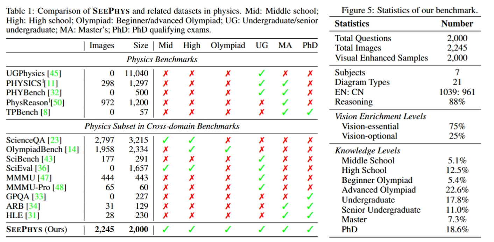

# SeePhys: Does Seeing Help Thinking? -- Benchmarking Vision-Based Physics Reasoning

 
 
 


 


<p align="center">
     <br>
</p>

Official repository for the paper "[SeePhys: Does Seeing Help Thinking? -- Benchmarking Vision-Based Physics Reasoning](https://arxiv.org/pdf/2505.19099)".

🌟 For more details, please refer to the project page with dataset exploration and leadboard: [https://seephys.github.io/](https://github.com/SeePhys/seephys-project).


[[🌐 Webpage](https://seephys.github.io/)] [[📖 Paper](http://arxiv.org/abs/2505.19099)] [[🤗 Huggingface Dataset](https://huggingface.co/datasets/SeePhys/SeePhys)] [[🏆 Leaderboard](https://seephys.github.io/)][[🎉Challenge](https://sites.google.com/view/ai4mathworkshopicml2025/challenge)]


## 📖 Outlines
- [💥 News ](https://github.com/SeePhys/seephys-project?tab=readme-ov-file#-news)
- [👀 About SeePhys](https://github.com/SeePhys/seephys-project?tab=readme-ov-file#-about-seephys)
- [🏆 Leaderboard ](https://github.com/SeePhys/seephys-project?tab=readme-ov-file#-leaderboard-on-the-benchmark-2000-samples)
- 💪 [ Contributing to our Leaderboard](https://github.com/SeePhys/seephys-project?tab=readme-ov-file#contributing-to-the-our-leaderboard)
- [🚀 Evaluation with VLMEvalKit](https://github.com/SeePhys/seephys-project?tab=readme-ov-file#-evaluation-with-vlmevalkit)
- [📐 Dataset Examples](https://github.com/SeePhys/seephys-project?tab=readme-ov-file#-dataset-examples)
- [📈 Citation](https://github.com/SeePhys/seephys-project?tab=readme-ov-file#-citation)
- [🤝 Contributors](https://github.com/SeePhys/seephys-project?tab=readme-ov-file#-contributors)

## 💥 News
- **[2025.05.27]** 🔥 The [arXiv paper](http://arxiv.org/abs/2505.19099) is online!
- **[2025.05.24]** 🚀 We release the ***test*** set without ground truth at [[🤗 Huggingface Dataset]](https://huggingface.co/datasets/SeePhys/SeePhys), and the [evaluation code](https://github.com/SeePhys/seephys-project)!
- **[2025.05.24]** 🔥 We release the evaluation [code](https://github.com/SeePhys/seephys-project) using VLMEvalKit
- **[2025.05.21]** 🎉 Our SeePhys is officially open for challenges at the [2nd AI for Math Workshop at ICML 2025](https://sites.google.com/view/ai4mathworkshopicml2025/challenge)!


## 👀 About SeePhys

**SeePhys** is a **​full spectrum multimodal benchmark** for evaluating physics reasoning across different knowledge levels. 

<p align="center">
     <br>
</p>


It comprises **2,000 rigorously validated questions** covering a ​​comprehensive range of knoledge levels **from middle school to PhD qualifying exam levels**. These questions span **7 major fields** of both classical and modern physics. To assess the extent to which different models rely on visual information for reasoning, we curate **two subsets with different visual information enrichment** and additionally compile supplementary copies of 2,000 purely visual instances where all problem statements in texts are presented in picture form. Through meticulous selection of **21 diagram types** by domain experts, each problem challenges frontier MLLMs to integrate domain knowledge with visual understanding of physics diagrams (e.g., Feynman diagrams for particle interactions and Circuit diagrams for Electromagnetism).
<p align="center">
     <br>
</p>


The figure below showcases examples of ​**​Vision-Essential​**​ and ​**​Vision-Optional​**​ samples. 
<p align="center">
     <br>
</p>

Our experiments reveal that MLLMs encounter significant challenges in solving ​**​Vision-Essential​**​ problems, whereas for ​**​Vision-Optional​**​ problems, even when images only provide supplementary information, they can still enhance the model's problem-solving capabilities.

<p align="center">
     <br>
</p>
With **SeePhys**, we conduct extensive experiments to evaluate 28 leading LLMs and MLLMs such as o4-mini and Gemini-2.5-Pro. The results reveal that even with extensive chain-of-thought, none of the current models could surpass 55\% accuracy. Our analysis reveals that even non-essential diagrams can enhance physics reasoning performance when presented to MLLMs. 


## 🏆 Leaderboard on SeePhys (2000 samples)
Accuracy scores of LLMs:

| **#** | LLMs                       | Mid         | High        | BO          | AO          | UG          | SUG         | MA          | PhD         | Total       |
| ----- | -------------------------- | ----------- | ----------- | ----------- | ----------- | ----------- | ----------- | ----------- | ----------- | ----------- |
| **1** | **DeepSeek-R1🥇**          | **54.9**    | **46.9**    | **47.7**    | **31.9**    | **49.9**    | **34.2**    | **49.0**    | **41.2**    | **42.2**    |
| **2** | **DeepSeek-V3🥈**          | <u>53.9</u> | <u>42.6</u> | <u>36.4</u> | <u>22.8</u> | <u>45.4</u> | <u>29.7</u> | <u>35.9</u> | <u>37.5</u> | <u>36.0</u> |
| **3** | **Qwen3-235B-A22B🥉**      | 47.1        | 33.7        | 31.8        | 20.4        | 41.2        | 25.1        | 31.7        | 30.7        | 31.1        |
| **4** | **QwQ-32B**                | 47.1        | 42.2        | 44.9        | 15.5        | 40.0        | 20.1        | 32.4        | 24.0        | 29.7        |
| **5** | **R1-Distilled-Llama-70B** | 48.0        | 41.4        | 34.6        | 14.2        | 31.5        | 16.0        | 28.9        | 25.9        | 26.9        |
| **6** | **Llama-4-Scout-17B**      | 48.0        | 36.5        | 31.8        | 11.3        | 28.5        | 14.2        | 28.3        | 26.1        | 24.8        |
| **7** | **Qwen2.5-72B**            | 41.2        | 40.2        | 25.2        | 8.2         | 26.8        | 12.8        | 18.6        | 17.8        | 21.1        |
| **8** | **Gemma3-27B**             | 21.6        | 36.5        | 30.8        | 5.1         | 23.1        | 9.1         | 15.2        | 11.9        | 16.9        |
| **9** | **Llama-3.1-8B**           | 26.5        | 15.7        | 17.8        | 3.9         | 7.6         | 3.7         | 10.3        | 8.4         | 9.2         |


Accuracy scores of MLLMs:

| #   | MLLMs                | Mid         | High        | BO          | AO       | UG          | SUG         | MA          | PhD         | Total       |
| --- | -------------------- | ----------- | ----------- | ----------- | -------- | ----------- | ----------- | ----------- | ----------- | ----------- |
| **1**   | **Gemini-2.5-Pro🥇**     | <u>69.6</u> | **66.7**    | **64.5**    | **46.7** | **64.2**    | **50.2**    | **53.8**    | <u>44.2</u> | **54.9**    |
| **2**   | **o4-mini🥈**            | 66.7        | <u>61.8</u> | <u>56.1</u> | 41.8     | 53.8        | <u>45.7</u> | 51.0        | **53.4**    | <u>51.9</u> |
| **3**   | **o1🥉**                 | 60.8        | 56.6        | 50.5        | 32.5     | <u>54.4</u> | 40.6        | <u>52.4</u> | 40.4        | 45.6        |
| **4**   | **Doubao-1.5-pro**       | **70.6**    | 58.2        | 49.5        | 29.2     | 56.6        | 34.7        | 40.7        | 37.5        | 43.9        |
| **5**   | **o3-mini**              | 47.1        | 46.2        | 39.3        | 28.3     | 47.0        | 36.1        | 48.3        | 42.3        | 40.3        |
| **6**   | **GPT-4.1**              | 51.0        | 52.6        | 41.1        | 17.0     | 39.7        | 31.1        | 42.1        | 35.6        | 35.3        |
| **7**   | **Claude-3.7-Sonnet**    | 52.9        | 51.8        | 43.0        | 16.7     | 41.4        | 26.5        | 33.8        | 32.4        | 34.6        |
| **8**   | **Qwen2.5-VL-72B-Inst**  | 61.8        | 42.2        | 29.0        | 10.4     | 29.9        | 14.6        | 18.6        | 19.4        | 24.2        |
| **9**   | **QVQ-72b-preview**      | 38.2        | 36.5        | 30.8        | 11.3     | 25.9        | 14.2        | 26.2        | 20.2        | 22.5        |
| **10**  | **GPT-4o**               | 37.3        | 39.0        | 34.6        | 7.5      | 23.4        | 15.5        | 24.1        | 21.8        | 21.9        |
| **11**  | **Llama-3.2-90B-Vision** | 21.6        | 25.7        | 22.4        | 3.9      | 9.3         | 10.0        | 12.4        | 8.9         | 11.7        |
| **12**  | **Qwen2.5-VL-7B-Inst**   | 39.2        | 25.3        | 21.5        | 4.2      | 8.7         | 5.9         | 10.3        | 7.3         | 11.6        |
| **13**  | **Qwen2.5-VL-3B-Inst**   | 30.4        | 21.3        | 13.1        | 2.9      | 10.4        | 7.3         | 6.2         | 6.2         | 9.8         |
| **14**  | **Qwen2-VL-7B-Inst**     | 24.5        | 17.3        | 14.0        | 4.4      | 8.5         | 4.6         | 10.3        | 7.0         | 9.2         |
| **15**  | **LLaVA-NeXT-7B**        | 14.5        | 12.7        | 11.2        | 5.5      | 13.2        | 8.2         | 11.0        | 9.4         | 8.7         |
| **16**  | **Llama3.2-11B-Vision**  | 23.5        | 18.5        | 14.0        | 4.2      | 5.4         | 3.7         | 4.8         | 7.5         | 8.3         |
| **17**  | **Phi-4-multimodal**     | 20.6        | 12.4        | 12.1        | 4.4      | 7.0         | 5.0         | 8.3         | 4.9         | 7.6         |
| **18**  | **InternVL2.5-8B**       | 17.6        | 12.4        | 9.3         | 2.9      | 5.6         | 3.2         | 4.1         | 5.1         | 6.2         |
| **19**  | **LLaVA-OneVision-7B**   | 20.6        | 10.8        | 12.1        | 2.7      | 5.4         | 2.3         | 6.2         | 5.4         | 6.1         |

## 💪Contributing to our Leaderboard

<p align="center">
     <br>
</p>
Our SeePhys is now open for submissions at the ​**​ICML 2025 Challenge on Automated Math Reasoning and Extensions​**​! To evaluate your model, please submit benchmark results to our website following the official [guidelines](https://sites.google.com/view/ai4mathworkshopicml2025/challenge). 
We strongly encourage all participants to concurrently submit their technical reports to the ​**​ICML 2025 AI for Math Workshop​**​.

- Submission Guidelines: https://www.codabench.org/competitions/7925/
- Challenge Details: https://sites.google.com/view/ai4mathworkshopicml2025/challenge
- Workshop Details: https://sites.google.com/view/ai4mathworkshopicml2025/home


## 🚀 Evaluation with VLMEvalKit

We have provided the evaluation code using [VLMEvalKit](https://github.com/open-compass/VLMEvalKit) for our SeePhys. To ensure fairness in the [challenge](https://sites.google.com/view/ai4mathworkshopicml2025/challenge), we will release the ground-truth to the public on ​**​July 18th​**​.


## 📐 Dataset Examples

Examples for problem versions within different subjects, knowledge levels and vision information enrichments.
<p align="center">
     <br>
</p>

## 📈 Citation

If you find **SeePhys** useful for your research and applications, please kindly cite using this BibTeX:

```latex
@article{xiang2025seephys,
  title={SeePhys: Does Seeing Help Thinking? -- Benchmarking Vision-Based Physics Reasoning},
  author={Kun Xiang, Heng Li, Terry Jingchen Zhang, Yinya Huang, Zirong Liu, Peixin Qu, Jixi He, Jiaqi Chen, Yu-Jie Yuan, Jianhua Han, Hang Xu, Hanhui Li, Mrinmaya Sachan, Xiaodan Liang},
  journal={arXiv preprint arXiv:2505.19099},
  year={2025}
}
```

## 🤝 Contributors
Here are the key contributors to this project:

**Kun Xiang**<sup>1</sup>, **Heng Li**<sup>1</sup>, **Terry Jingchen Zhang**<sup>2</sup>, **Yinya Huang**<sup>2</sup>, **Zirong Liu**<sup>1</sup>, **Peixin Qu**<sup>1</sup>, **Jixi He**<sup>1</sup>, **Jiaqi Chen**<sup>4</sup>, **Yu-Jie Yuan**<sup>3</sup>, **Jianhua Han**<sup>3</sup>, **Hang Xu**<sup>3</sup>, **Hanhui Li**<sup>1</sup>, **Mrinmaya Sachan**<sup>2</sup> , **Xiaodan Liang**<sup>1</sup> 


<sup>1</sup> Sun Yat-sen University <sup>2</sup> ETH Zurich <sup>3</sup> Huawei Noah's Ark Lab <sup>4</sup> The University of Hong Kong
